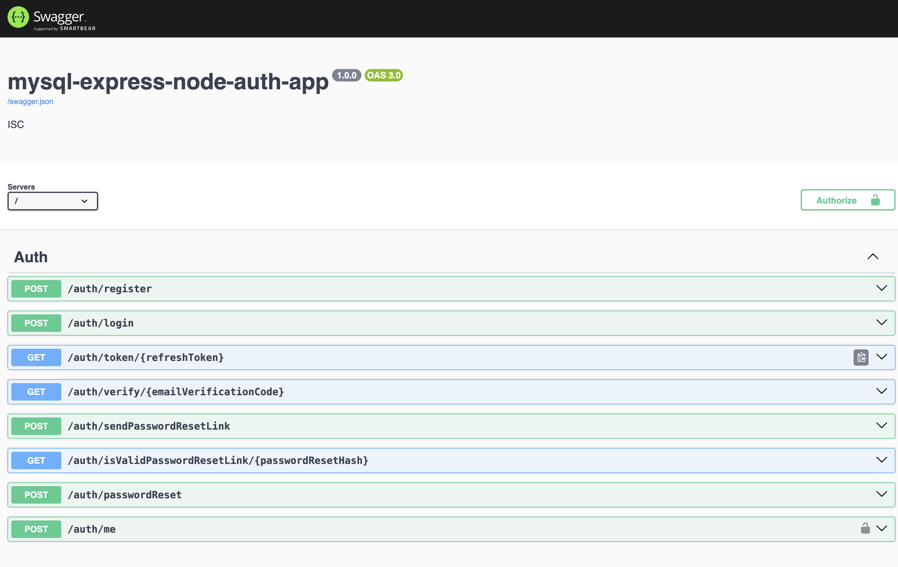

This is a full-fledged User Authentication app created using Express, TypeORM, Passport, Swagger, MySQL, and Node. This app will give you an overall concept of how authentication works.

Here is the list of APIs this app contains:"

 

# Project Setup and Local Run Guide

This guide provides step-by-step guide on setting up and running the "mysql-express-node-auth-app" project locally on your machine. Please follow the steps outlined below.

Below is a summary of key features and instructions for running the project:

## Features:

### Technology Stack:

1. Express.js and TypeScript for server-side development.
2. TypeORM for database interactions.
3. Passport for authentication strategies.
4. Swagger for API documentation.
5. Docker desktop

### Development Tools:

1. Nodemon for automatic server restart during development.
2. `ts-node` for running `TypeScript` files directly.
3. Concurrently for running multiple npm scripts concurrently.
4. Database Migrations:

TypeORM is used for managing database migrations.
Commands for creating, generating, applying, and rolling back migrations are provided.

## Prerequisites

Before getting started, ensure that you have the following installed on your machine:

- Node.js: [Download and Install Node.js](https://nodejs.org/)
- npm (Node Package Manager): Included with Node.js installation
- Docker Desktop

## Project Setup

1. **Clone the Repository:**
   Open a terminal and run the following command to clone the project repository:

   ```bash
   git clone https://github.com/dev-scripts/mysql-express-node-auth-app.git
   ```

2. **Navigate to the Project Directory:**
   Change into the project directory using the following command:

   ```bash
   cd mysql-express-node-auth-app
   ```

## Running the Project Locally

 ### 1. Change the file permissions `run.sh` to make it executable
```bash
 chmod +x run.sh 
```

 ### 2. copy the `.env.example` file and make new `.env` file 
```bash
 ./run.sh env
```

 ### 3. Start the project. Below command will pull the MySQL, Node images, install the dependencies. 
```bash
 ./run.sh start
```
once docker containers are up and running project is accessable  `http://localhost:8000/docs`. This is the Swagger UI which will list all the API endpoints.

 ### 4. Go inside app container. 
```bash
 ./run.sh bash
```

Once you are inside the docker container you can run the below commands. These commands are for managing database migrations using TypeORM.
- **Run Migrations:**

  ```bash
  npm run migration:up
  ```

- **Rollback Migrations:**

  ```bash
  npm run migration:down
  ```
- **Create a Migration:**

  ```bash
  npm run migration:create
  ```

- **Generate a Migration:**

  ```bash
  npm run migration:generate
  ```

Now you should have the "mysql-express-node-auth-app" project up and running locally. If you encounter any issues, please refer to the project documentation or seek assistance from the project's maintainers.

Feel free to customize the content as needed for your specific project.
